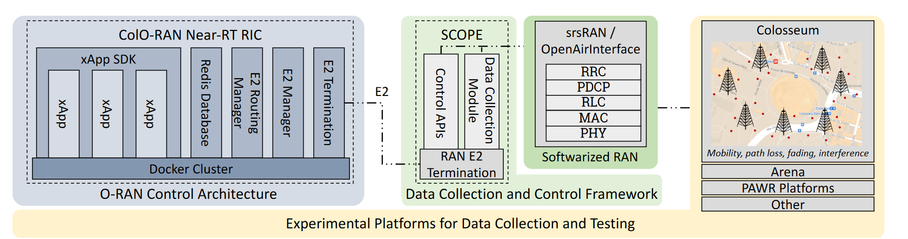

# OPEN RAN GYM Configuration

## Description

## Tools used

## Architecture

### OpenRAN Gym

- OpenRAN Gym includes
    - one or multiple publicly-accessible experimental platforms for data collection and testing i.e. [Colosseum](pubs/bonati2021colosseum.pdf), [Arena](pubs/Berinbonati2021Arena.pdf), the platforms of the [PAWR program](https://advancedwireless.org/)
    - a softwarized RAN - implemented through [srsRAN](pubs/srslte.pdf) or [OpenAirInterface](https://www.sciencedirect.com/science/article/abs/pii/S1389128619314410)
    - a data collection and control framework with Application Programming Interfaces (APIs) to control the cellular stacks and extract statistics from them [SCOPE](pubs/SCOPE.pdf)
    - an O-RAN control architecture with interfaces to connect to the RAN and control it through AI/ML solutions (e.g., (ColO-RAN)[pubs/2112.09559.pdf]). 
    
    
The platform-independence of OpenRAN Gym allows users to collect data, design and train solutions in heterogeneous environments before deploying them on production networks. 
In this way, several evaluation and fine-tuning iterations can be performed in controlled setups to guarantee that the final AI/ML model behaves as expected.

### Collosseum

Colosseum is a large-scale wireless network emulator that allows users to test solutions at scale through 128 USRP X310 SDRs and compute servers (called Standard Radio Nodes (SRNs)), and to emulate the conditions of wireless environments (e.g., path loss,  fading, user mobility and signal interference) through a Massive Channel Emulator (MCHEM) that controls 128 additional USRP X310. MCHEM is capable of capturing the conditions of the wireless channel with high fidelity. Wireless channels can be modeled through
ray-tracing software [20], reproduced in MCHEM through FPGA-based finite impulse response filters. In this way, Colosseum allows users to perform experiments in a multitude of different emulated terrains, as if the SDRs were operating in the real-world. Similarly, Colosseum can also emulate traffic with different characteristics and distributions through the Traffic Generator (TGEN) system, which generates and manages traffic flows between the SRNs

- [Github repo](https://github.com/colosseum-wiot/colosseum-srslte-20-04) - Colosseum srsLTE reporitory based on srsLTE release_20_04. Timing advance estimation procedures and configuration files have been modified for srsLTE to work on Colosseum.

## Important references
- https://github.com/open-5g/openrangym/blob/ac45f67fbed15aae9a48fcd15bd98a9c683ded33/_posts/tutorials/2022-02-11-ns-o-ran.md
